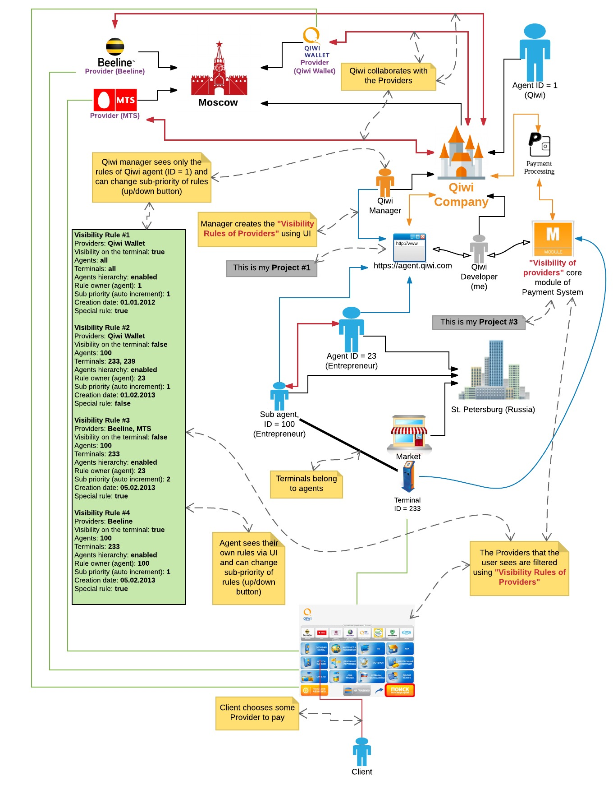

## For [payment kiosks](https://en.wikipedia.org/wiki/Interactive_kiosk): «Visibility of providers» module v1.x, payment system core

### Description

* Country: **Russia**  
* Company: **Qiwi Plc**  
* Working schedule: **Full-time work**  
* Duration: **09/2011-12/2011 (4mths)**  
* Position according to employment contract: **Senior/Lead Programmer**  
* Role: **Principal Back-End Developer**  
* Team: **Alex Poter**  

### Schema

  