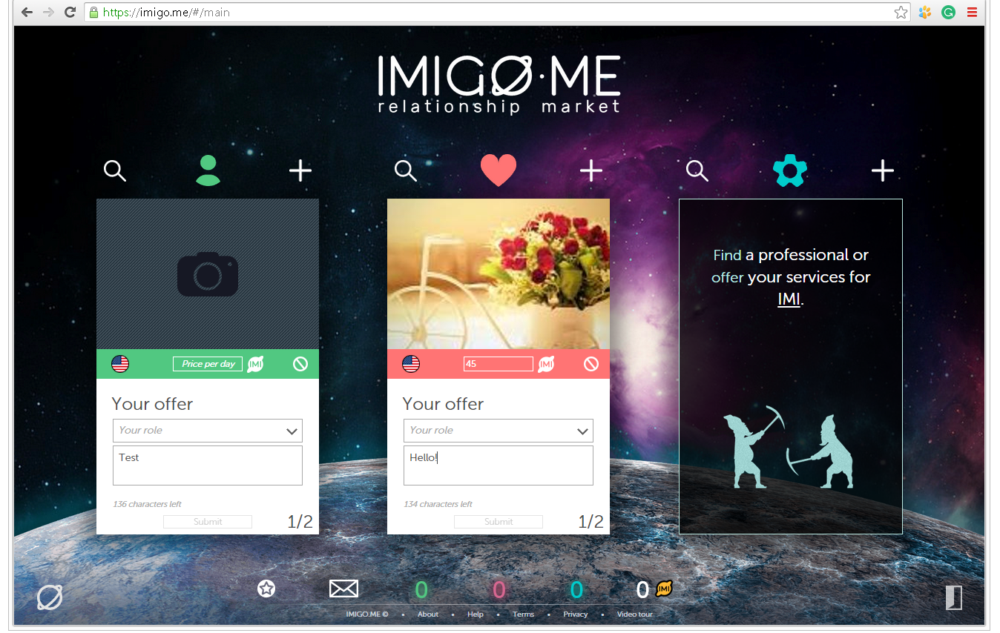
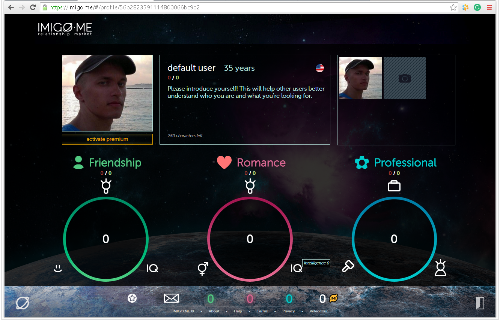
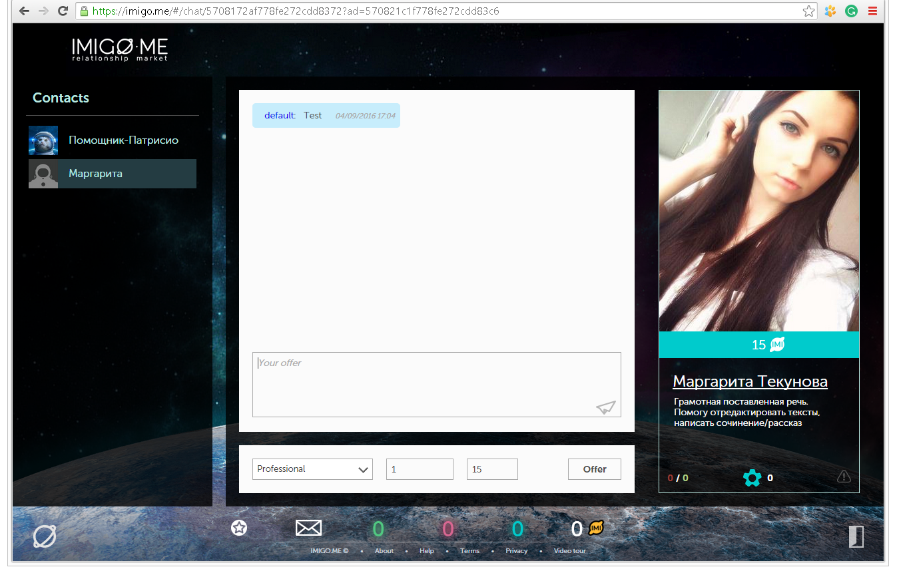
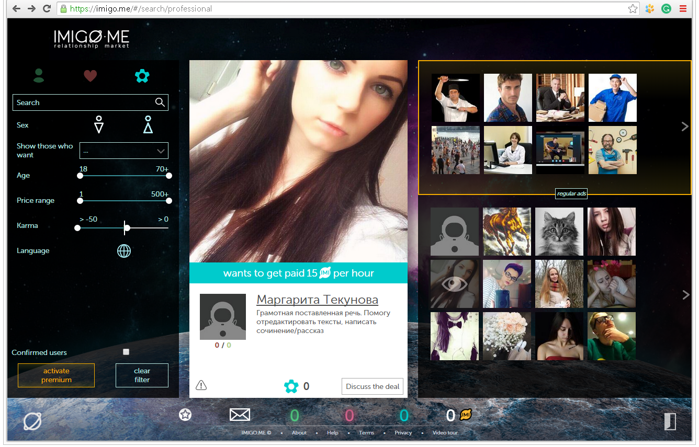
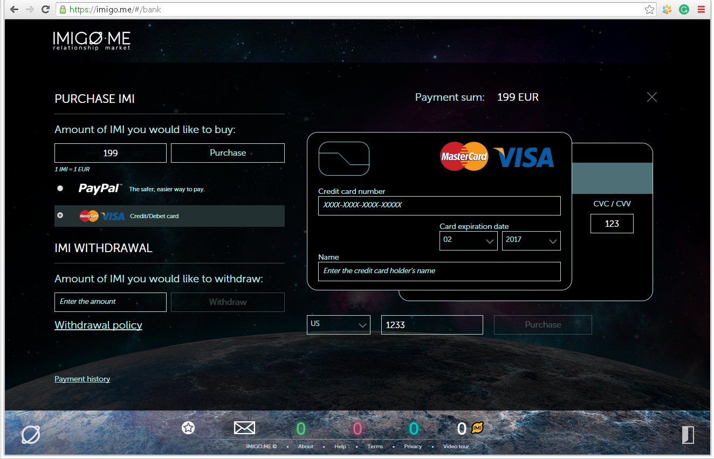

## Relationship market

### Description  

* Country: **Russia**  
* Company: **Imigo.me Start-up**  
* Working schedule: **part-time**  
* Duration: **12/2015-02/2016 (3mths)**  
* Position in accordance with employment contract: **Principal Front-End Developer**  
* Role: **Architect and Principal Front-End Developer**  
* Team:  
**Alex Poter**  
[**Dmitriy Sorokin** as a Front-End Developer](https://www.linkedin.com/in/cyberdemon)  

### Project repository  

The app module is based on the **https://github.com/swimlane/angular1-systemjs-seed** fork.  

[Under an agreement with the employer, I have the right to publish the source code for preview here](src)  

#### This is my own coding style

[app module](src/app/src)  
[ui-less-build-utils](src/ui-less-build-utils/src/ui-less-build-utils.less)  
[uiLayout](src/uiLayout/src/ui-layout.less)  

[User service](src/app/src/common/services/user.js)  
[Router service](src/app/src/common/services/router.js)  
[Uploader service](src/app/src/common/services/uploader.js)  
[Tooltip service](src/app/src/common/services/uiTooltip.js)  

### Preview  

[Video preview](preview/preview.mp4)  

  
  
  
  
  