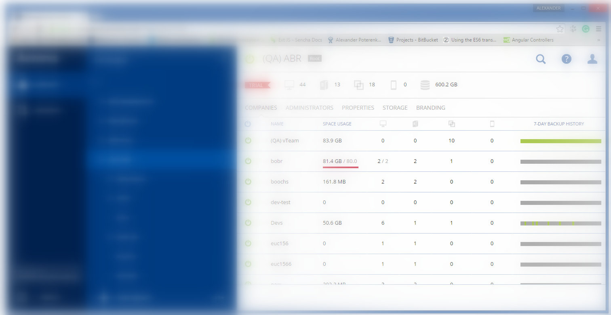

## Private online office baas.acronis.com for user groups and settings management

### Description  

* Country: **Russia**  
* Company: **Acronis LLC**  
* Working schedule: **full-time**  
* Duration: **03/2015-12/2016 (1yrs 10mths)**  
* Position according to employment contract: **Senior Software Developer**  
* Role: **Principal Front-End Maintainer**  
* Team:  
**Alex Poter**  
**Mikhail Rozhin** as a Senior Software Developer  
**Alexander Luckin** as a Senior Software Developer  

### This is my own coding style

[ExtJS6 plugins](https://github.com/apoterenko/extjs-ts-console/tree/master/app/plugin/form/field)  
[smart-histogram](https://github.com/apoterenko/resume/tree/master/scheme/project09/src/smart-histogram)  
[ExtJsTsEmitter fork](https://github.com/apoterenko/ExtJsTsEmitter/commits/master)  

### Preview  

  