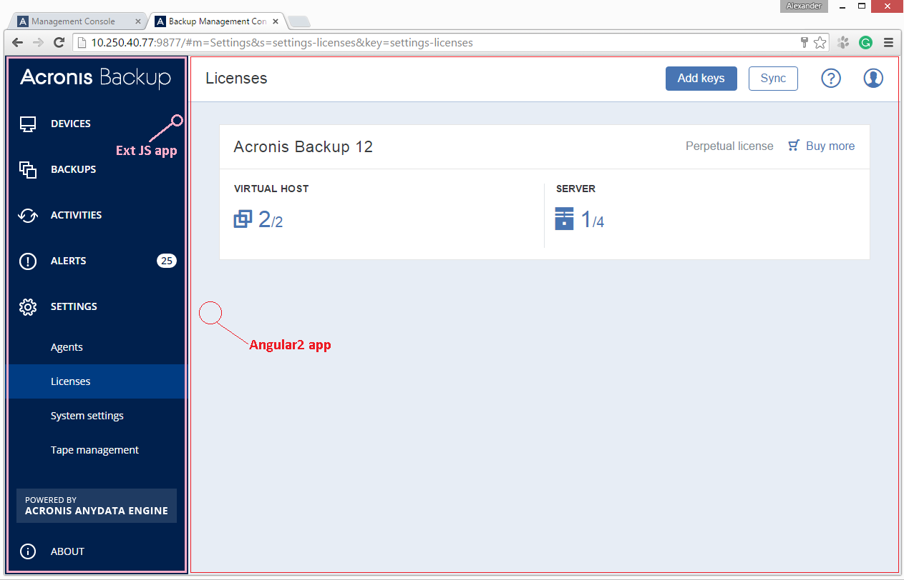
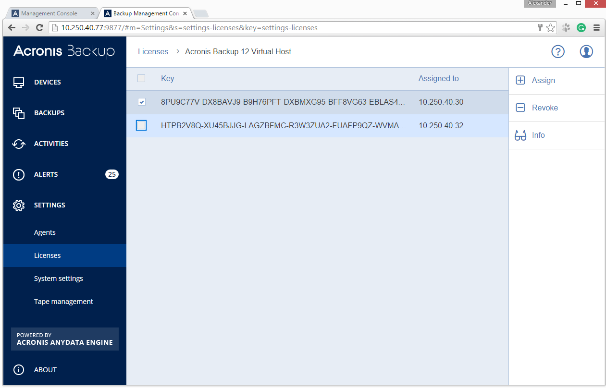
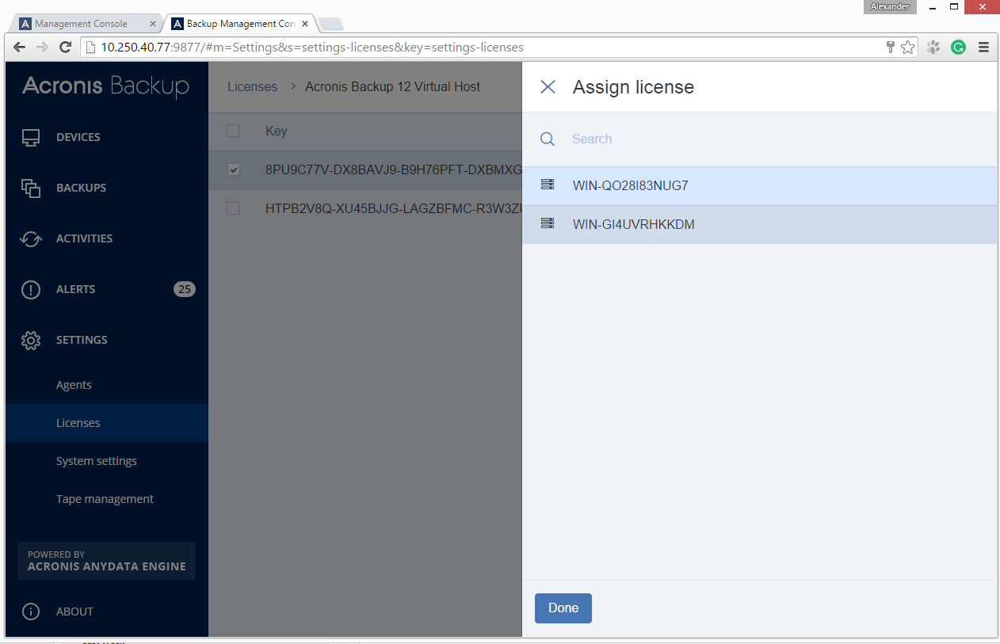

## User licence management module [a sub-module of «On-Premise Backup Software»]

### Description  

* Country: **Russia**  
* Company: **Acronis LLC**  
* Working schedule: **full-time**  
* Duration: **02/2016-06/2016 (5mths)**  
* Position according to employment contract: **Senior Software Developer**  
* Role: **Principal Front-End Developer**  
* Team:  
**Alex Poter**  
**Mikhail Rozhin** as a Senior Software Developer  
**Anton Staroverov** as an HTML Developer  

### This is my own coding style  

[angular2-i18next](https://github.com/apoterenko/angular2-i18next) [**1.0.5**](https://www.npmjs.com/package/angular2-i18next)  
[angular2-post-message](https://github.com/apoterenko/angular2-post-message) [**1.0.2**](https://www.npmjs.com/package/angular2-post-message)  
[angular2-di-helper](https://github.com/apoterenko/angular2-di-helper) [**0.0.28**](https://www.npmjs.com/package/angular2-di-helper)  

### Preview  

  
  
  