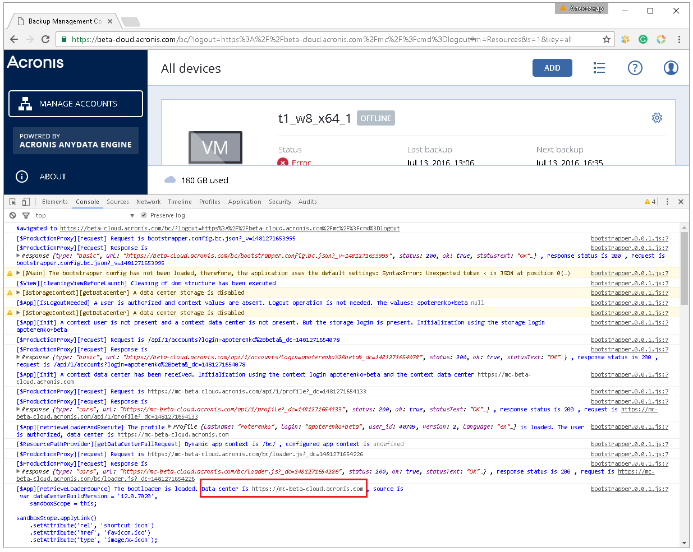

## Multi-functional web applications bootstrapper for a standalone data centre and geo-distributed data centres

### Description  

* Country: **Russia**  
* Company: **Acronis LLC**  
* Working schedule: **full-time**  
* Duration: **10/2016-12/2016 (3mths)**  
* Position in accordance with employment contract: **Senior Software Developer**  
* Role: **Principal Front-End Developer**  

### Project repository  

[ts-app-bootstrapper-seed](https://github.com/apoterenko/ts-app-bootstrapper-seed) **0.0.1**  
[ts-smart-logger](https://github.com/apoterenko/ts-smart-logger) [**0.0.4**](https://www.npmjs.com/package/ts-smart-logger)  

### Preview  

#### «On-Premise Backup Software» [standalone mode]  

#### «Cloud Backup as a Service» [cloud mode]  
  
  
  